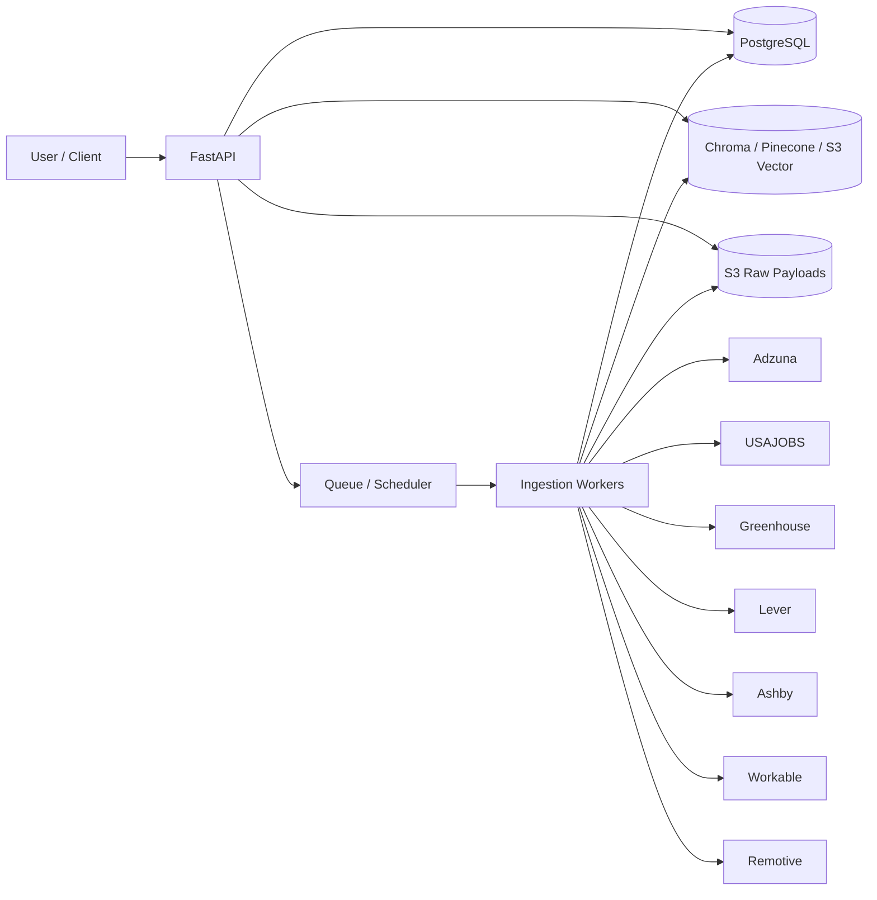
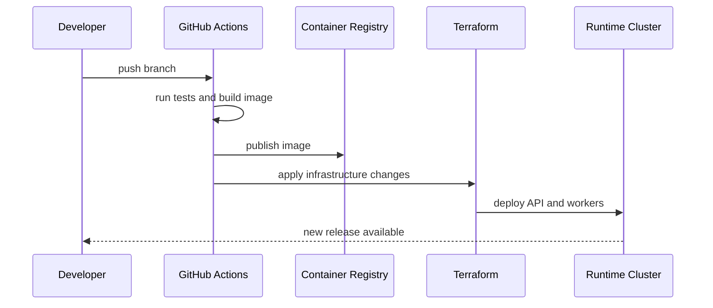

# DevOps and Infra Architecture

## Goal

Provide a deployment model for the job-matching service that is simple for development, reproducible in CI, and ready for a cloud deployment path.

## Recommended Stack

- API service: Python + FastAPI
- Background jobs: Celery, RQ, or a lightweight scheduler depending on ingestion volume
- Relational database: PostgreSQL
- Local dev vector store: Chroma
- Production vector store: Pinecone or S3-backed vector storage
- Raw payload/object storage: S3
- Container runtime: Docker
- IaC: Terraform
- CI/CD: GitHub Actions
- Observability: OpenTelemetry plus CloudWatch or an equivalent centralized log/metrics stack

## Architecture

## Environments

### Local

- Docker Compose for API, Postgres, Chroma, and an optional worker process.
- `.env`-driven configuration.
- Seed fixtures for job sources and scoring tests.

### CI

- Run linting, unit tests, integration tests with fixtures, and schema validation.
- Build container images on merge.
- Block deploys when ingestion or ranking tests fail.

### Production

- Run the API and workers in containers behind a load balancer.
- Store secrets in a managed secret store.
- Store raw payloads in S3 with lifecycle rules.
- Keep vector-store selection configurable so the same app can run on Chroma for small deployments or Pinecone/S3-backed storage for larger ones.

## Deployment Flow

## Operational Concerns

- Separate ingestion from API serving so source outages do not affect search traffic.
- Add retries and dead-letter handling for failed source fetches.
- Track source latency, failure rate, ingest counts, and ranking distribution.
- Version embeddings and normalization logic so reindexing is reproducible.
- Use idempotent upserts everywhere.

## Security

- Keep API keys out of source control.
- Restrict source credentials to the minimum required scope.
- Encrypt object storage and database traffic in transit and at rest.
- Do not store resume text or feedback without access controls if the app becomes multi-user.

