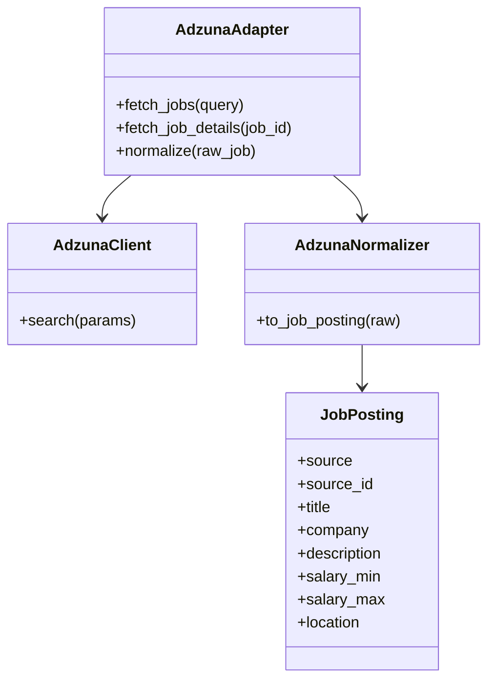
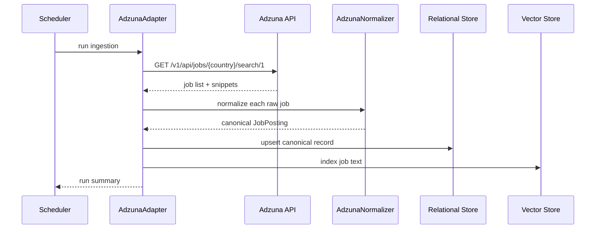

# Adzuna Ingestion Design

## Purpose

Adzuna is the broad-coverage aggregator in the stack. It provides keyword, salary, location, employment-type, and category filters through a public search API, which makes it a good first ingestion source.

Official docs: [Adzuna Search API](https://developer.adzuna.com/docs/search)

## Source Contract

- Endpoint: `GET /v1/api/jobs/{country}/search/{page}`
- Required credentials: `app_id`, `app_key`
- Core query params used by this design: `results_per_page`, `what`, `what_exclude`, `where`, `sort_by`, `salary_min`, `full_time`, `permanent`
- Response fields consumed: `id`, `title`, `company.display_name`, `location.display_name`, `location.area`, `description`, `redirect_url`, `created`, `salary_min`, `salary_max`, `contract_type`, `contract_time`, `category.tag`, `salary_is_predicted`, `latitude`, `longitude`

## UML

## API Sequence

## Ingestion Notes

- Use Adzuna for broad discovery and early recall.
- Persist the snippet and the redirect URL, because the public API response contains truncated descriptions.
- Prefer query parameters that align with the user profile, such as location, salary floor, and employment type.
- Use the source id and redirect URL as the primary dedupe anchors.

## Normalization Rules

- Map `id` to `source_id`.
- Map `title` to the canonical job title after trimming whitespace and collapsing internal spacing.
- Map `company.display_name` to `company`.
- Map `redirect_url` to `apply_url`.
- Map `created` to `posted_at`.
- Map `location.display_name` to the canonical location string and retain `location.area` as a hierarchy array.
- Preserve `description` as the snippet and mark it as truncated when the source response omits the full body.
- Convert `salary_min` and `salary_max` into a normalized numeric salary range when present.
- Carry `contract_type` and `contract_time` into the canonical employment-type fields.
- Carry `category.tag` into a source category field for filtering and reporting.
- Preserve `salary_is_predicted` as a confidence flag.

## Validation

- Verify required fields: title, company, source id, redirect URL, and location or remote state.
- Allow salary to remain unknown when the API does not provide it.
- Reject empty or boilerplate descriptions.
