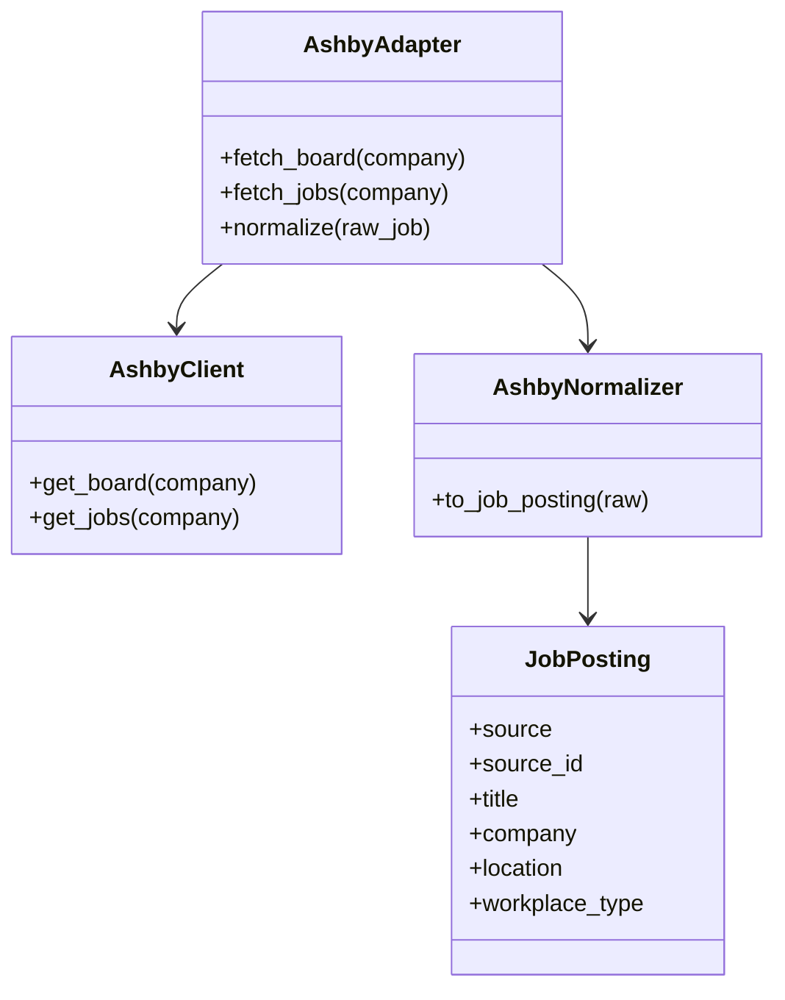
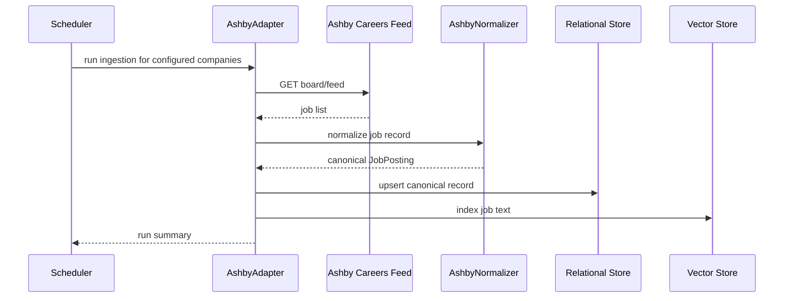

# Ashby Ingestion Design

## Purpose

Ashby is a strong secondary source for growth-stage companies. It is best handled as a curated employer connector because access patterns and public feed shapes vary by company board.

## Source Contract

- Endpoint: company-specific public careers board or board feed
- Required configuration: a company board identifier and the corresponding public feed URL pattern
- Response fields consumed: job id, title, company name, location, workplace type, team, tags, description, apply URL, and any posted/salary metadata exposed by the public feed
- Exact endpoint shape must be finalized per employer before implementation

## UML

## API Sequence

## Ingestion Notes

- Treat this connector as company-specific.
- Normalize location and workplace type carefully because Ashby boards often carry high-quality remote/hybrid metadata.
- If a company has no public feed, do not fall back to scraping without explicit permission.

## Normalization Rules

- Map the public job identifier to `source_id`.
- Map the job title to `title`.
- Map the company name to `company`.
- Map the public job URL to `apply_url`.
- Preserve workplace type as a canonical remote classification.
- Preserve team and tags as ranking metadata.
- Preserve salary if the public feed exposes it.
- Mark the source as curated/company-specific so it is not treated as a global board.

## Validation

- Verify the company board is reachable before ingestion.
- Preserve tags, team, and workplace metadata where available.
- Deduplicate repeated company postings by source id and canonical URL.
