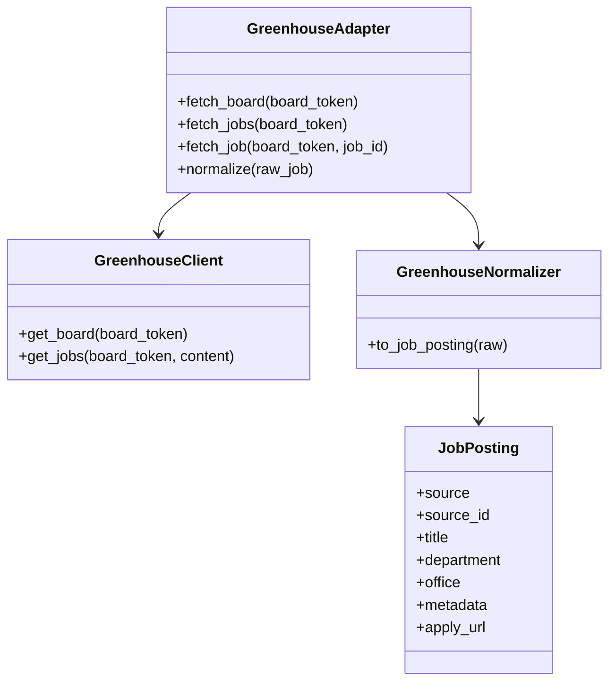
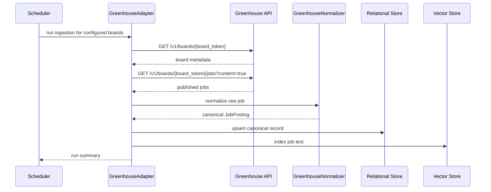

# Greenhouse Ingestion Design

## Purpose

Greenhouse is the curated employer-board source for product and engineering companies. It is useful when the application targets specific companies with public job boards.

Official docs: [Greenhouse Job Board API](https://developers.greenhouse.io/job-board.html)

## Source Contract

- Endpoint: `GET /v1/boards/{board_token}`
- Endpoint: `GET /v1/boards/{board_token}/jobs`
- Optional query param used by this design: `content=true`
- Response fields consumed: `id`, `internal_job_id`, `title`, `content`, `department`, `office`, `metadata`, board name, job location fields, and the public job URLs returned by the board API
- Authentication is not required for GET endpoints

## UML

## API Sequence

## Ingestion Notes

- The board token is the routing key; ingestion should be configured per employer.
- Use `content=true` when the full description is needed for matching.
- Public GET endpoints do not require authentication.
- This source is best treated as a curated employer connector, not a global board.

## Normalization Rules

- Map `id` to `source_id`.
- Map the board token to `source_board`.
- Map `title` to `title`.
- Map `content` to the canonical description body.
- Map `department` to `department`.
- Map `office` to `location`.
- Preserve `internal_job_id` as an internal reference when present.
- Preserve `metadata` as a structured free-form object.
- Map the public job URL to `apply_url`.
- If the board returns a company name, store it as `company`.

## Validation

- Verify job id, department, office, and content presence.
- Preserve metadata fields that may help downstream ranking, such as office and internal job id.
- Support prospect posts where `internal_job_id` is null.
