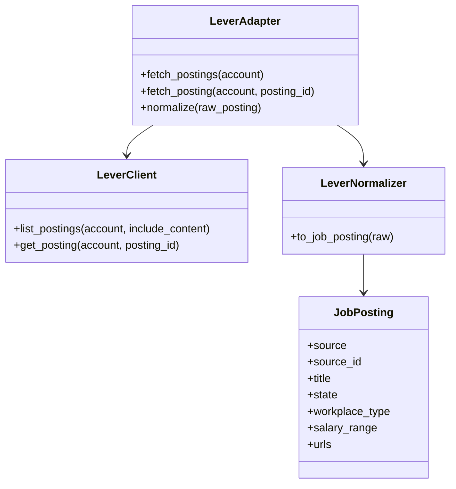
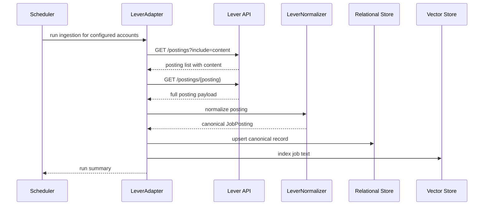

# Lever Ingestion Design

## Purpose

Lever is a common startup and tech-company careers-board source. It works well for employer-targeted ingestion because the job boards expose list and posting endpoints with rich job content.

Official docs: [Lever Developer Documentation](https://hire.lever.co/developer/documentation)

## Source Contract

- Endpoint: `GET /postings`
- Optional query params used by this design: `include=content`, `expand=followers`
- Response fields consumed: `id`, `text`, `state`, `categories`, `team`, `commitment`, `location`, `salary`, `urls.list`, `urls.show`, `urls.apply`, `workplaceType`, `tags`
- Only postings in `state=published` are indexed

## UML

## API Sequence

## Ingestion Notes

- Use the account slug as the board identifier.
- Prefer the posting list endpoint with `include=content` so the description is available without a second lookup.
- Preserve list/show/apply URLs as first-class fields.
- Treat workplace type, salary, and tags as useful ranking features.

## Normalization Rules

- Map `id` to `source_id`.
- Map `text` to `title`.
- Map `state` to a publishing-status field and index only `published` records.
- Map `commitment` and `categories` into employment-type and role-family fields.
- Map `location` to the canonical location string.
- Map the salary structure into the normalized compensation model when present.
- Map `urls.apply` to `apply_url` and `urls.show` to `source_url`.
- Preserve `workplaceType` as `remote`, `hybrid`, or `onsite` where available.
- Preserve `tags` as ranking metadata.

## Validation

- Verify posting state is published before indexing.
- Preserve the apply URL and show URL.
- Carry workplace type through to the canonical model for remote/hybrid filtering.
