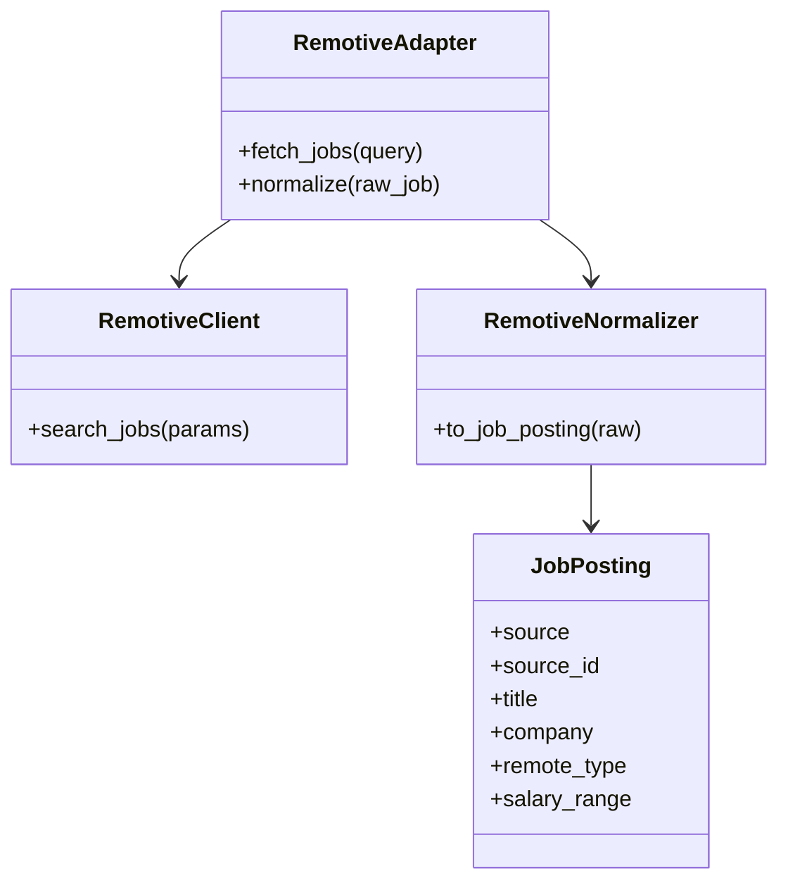
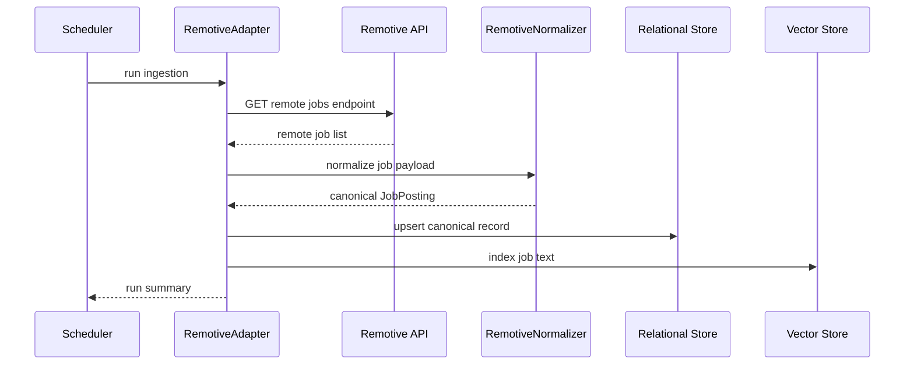

# Remotive Ingestion Design

## Purpose

Remotive is a remote-first jobs source that can reduce noise for users who want distributed work.

## Source Contract

- Endpoint: public remote-jobs API or feed configured for the Remotive source
- Response fields consumed: job id, title, company, category, job type, publication date, salary, URL, and any location or remote metadata exposed by the feed
- Exact request path should be pinned to the current official source before implementation

## UML

## API Sequence

## Ingestion Notes

- Use this source to bias toward remote roles.
- Preserve salary and location fields when present, but do not require them.
- Treat remote type as a first-class filter signal.

## Normalization Rules

- Map the public job identifier to `source_id`.
- Map the title to `title`.
- Map the company to `company`.
- Map the public job URL to `apply_url`.
- Map the publication date to `posted_at`.
- Preserve salary when present.
- Preserve category and job type as ranking metadata.
- Mark remote-first jobs with a high-confidence `remote_type` value.

## Validation

- Require a title, company, and description.
- Deduplicate by source id and posting URL.
- Mark the source as optional so the system still works when it is unavailable.
