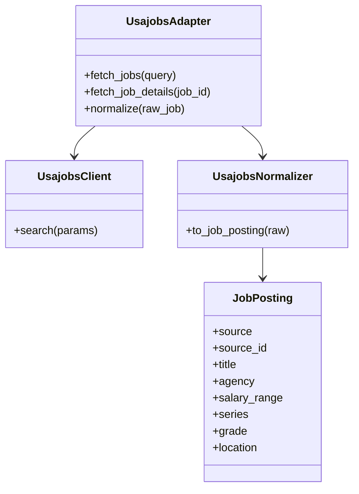
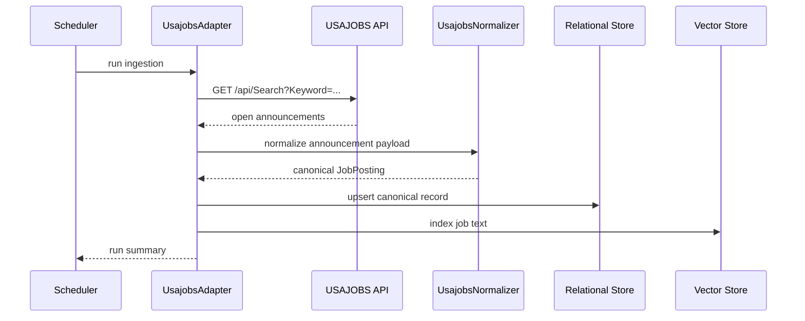

# USAJOBS Ingestion Design

## Purpose

USAJOBS is the federal-job source in the stack. It is useful when the target profile includes public-sector, policy, analyst, cybersecurity, software, or mission-support roles.

Official docs: [USAJOBS GET /api/Search](https://developer.usajobs.gov/api-reference/get-api-search)

## Source Contract

- Endpoint: `GET /api/Search`
- Authentication: API key
- Core query params used by this design: `Keyword`, `PositionTitle`, `RemunerationMinimumAmount`, `RemunerationMaximumAmount`, `PayGradeHigh`
- Additional standard filters should be supported by the adapter when they are present in the API reference, including location, hiring path, and agency filters
- Response fields consumed: announcement identifier, title, agency, locations, salary range, posting dates, closing date, series, grade, security clearance, travel requirement, duties, and eligibility details

## UML

## API Sequence

## Ingestion Notes

- Use keyword, title, salary, location, series, grade, and hiring-path filters where possible.
- Preserve federal-specific metadata such as series, grade, and announcement closing details.
- Treat the API as the canonical source for active federal openings.
- Maintain a separate mapping for federal terms that do not fit standard private-sector job schemas.

## Normalization Rules

- Map the announcement identifier to `source_id`.
- Map the job title to `title`.
- Map the agency name to `company`.
- Preserve the agency value separately as `source_agency`.
- Normalize salary bucket values into `salary_min` and `salary_max` ranges.
- Map `PayGradeHigh` and related grade data into `seniority`.
- Preserve `series` and `grade` as federal-specific metadata.
- Preserve `security clearance` and `travel percentage` as boolean or enumerated constraints in the canonical model.
- Map the primary public-facing job URL to `apply_url`.
- Map posting and closing dates to `posted_at` and `expires_at`.

## Validation

- Verify job number, title, agency, posting dates, and location data.
- Validate salary buckets and transform them into normalized numeric ranges.
- Preserve clearance and travel requirements when present.
