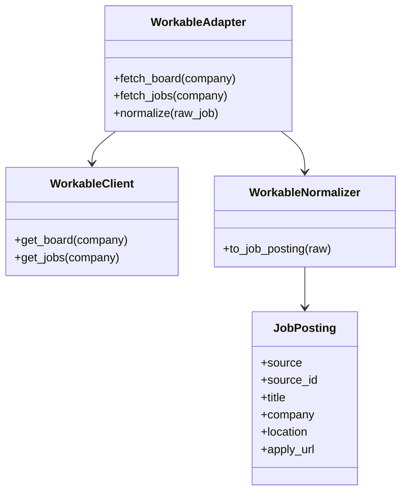
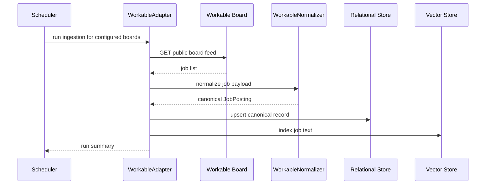

# Workable Ingestion Design

## Purpose

Workable is a practical SMB and startup source. It should be integrated only through public, permitted board feeds or official endpoint patterns.

## Source Contract

- Endpoint: company-specific public job board or public feed
- Required configuration: employer identifier or public board URL
- Response fields consumed: job id, title, company name, location, apply URL, description, compensation if exposed, and any public metadata fields
- Exact endpoint shape must be confirmed for each employer before implementation

## UML

## API Sequence

## Ingestion Notes

- Keep this connector behind explicit configuration.
- Prefer public board feeds and avoid brittle scraping.
- Preserve company and role metadata even when a posting has minimal structured fields.

## Normalization Rules

- Map the public job identifier to `source_id`.
- Map the posting title to `title`.
- Map the employer name to `company`.
- Map the canonical public job link to `apply_url`.
- Preserve description text as the canonical body text.
- Preserve any salary or location metadata that the feed exposes.
- Mark the source as employer-specific and optional.

## Validation

- Verify the board is public and reachable before indexing.
- Require a non-empty title, company, and apply URL or canonical posting URL.
- Reject postings that do not have enough text to be useful for matching.
